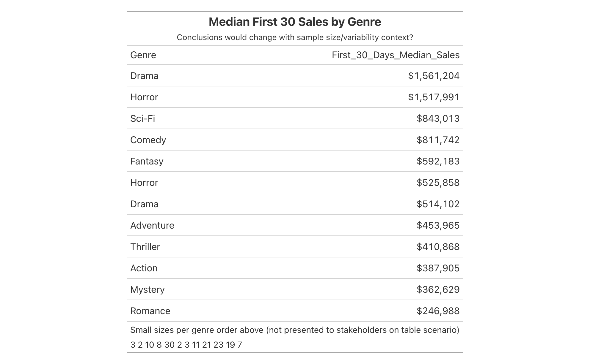

The example scenarios below are inspired by real world mistakes I've made and/or issues I've observed first hand.

```{r echo=FALSE, include = FALSE}
knitr::opts_chunk$set(echo=FALSE, warning=FALSE, message=FALSE, dpi=700)
```

```{r include = FALSE}
required_packages <- c('tidyverse', 'patchwork', 'MASS', 'ggpubr', 
                       'correlation', 'gt', 'reshape2', 'webshot2', 'htmltools', 'gtExtras')

for(p in required_packages) {
  if(!require(p,character.only = TRUE)) 
        install.packages(p, repos = "http://cran.us.r-project.org")
  library(p,character.only = TRUE)
}
```

## 1. Not applying business context on top of data used for analysis/visualization

-   Learning: sanity check data against your macro business context/judgement.
-   Are these realistic spend levels?

```{r}
# Create the example dataset
set.seed(42) # for reproducibility
ad_spend_data <- tibble(
  acronym = sample(combn(LETTERS, 2, FUN = paste, collapse = ""), 50),
  ad_spend = sample(1e8:1e9, 50, replace = TRUE)
)

# Plot the bar chart with y-axis in billions scale and smaller x-axis labels
ggplot(ad_spend_data, aes(x = reorder(acronym, ad_spend), y = ad_spend / 1e9)) + # Convert y to billions
  geom_bar(stat = "identity") +
  scale_y_continuous(labels = scales::dollar_format(scale = 1, suffix = "B")) + # Display y-axis in billions
  labs(
    title = "2022 Instagram Ad Spend",
    x = "Talent Acronym",
    y = "Ad Spend (in Billions $)",
    caption = "This data is fake and for illustrative purposes only."
  ) +
  theme_minimal() +
  theme(axis.text.x = element_text(angle = 45, hjust = 1, size = 6)) # Reduce size of x-axis text labels
```

## 2. Nudging stakeholders to incorrectly draw conclusion from small sample sizes / variable data

-   Learning: include sample size counts by default + measures of variability (via metrics and/or visualizations).

```{r out.width='100%'}
# # Set a seed for reproducibility
# set.seed(123)
# 
# # Create a tribble with 10 genres and random title counts
# genre_data_1 <- tribble(
#   ~Genre, ~Title_Count,
#   "Action", 23,
#   "Adventure", 11,
#   "Comedy", 8,
#   "Drama", 3,
#   "Horror", 2,
#   "Sci-Fi", 10,
#   "Fantasy", 30,
#   "Romance", 7,
#   "Mystery", 19,
#   "Thriller", 21
# )
# 
# genre_data_2 <- tribble(
#   ~Genre, ~Title_Count,
#   "Drama", 3,
#   "Horror", 2
# )
# 
# # Generate random first 30 days sales for each title
# genre_data_1 <- genre_data_1 %>%
#   rowwise() %>%
#   mutate(First_30_Days_Median_Sales = round(rnorm(1, mean = 500000, sd = 200000)))
# 
# genre_data_2 <- genre_data_2 %>%
#   rowwise() %>%
#   mutate(First_30_Days_Median_Sales = round(rnorm(1, mean = 1500000, sd = 50000)))
# 
# # Sort the genres by average and median first 30 days sales
# genre_data <- bind_rows(list(genre_data_1, genre_data_2)) %>%
#   arrange(-First_30_Days_Median_Sales)
# 
# # Print the sorted tribble
# table_gt <- genre_data %>%
#   dplyr::select(-Title_Count) %>%
#   gt() %>%
#   fmt_currency(First_30_Days_Median_Sales,
#                decimals = 0) %>%
#    tab_header(
#     ### can style using markdown
#     title = md("**Median First 30 Sales by Genre**"),
#     subtitle = "Conclusions would change with sample size/variability context?"
#   ) %>%
#   tab_footnote(
#     footnote = "Small sizes per genre order above (not presented to stakeholders on table scenario)",
#   ) %>%
#   tab_footnote(
#     footnote = genre_data %>% dplyr::select(Title_Count) %>% pull(),
#   )
# 
# ### work around given code is not working on notebook knit
# table_gt %>%
#   gtsave_extra("table_vis.png")


```

## 3. Not handling outliers when deriving correlations (1 of 2)

-   Learning: watch out for outliers when deriving correlations (especially with small sample sizes and when using Pearson correlation)

```{r}
### Inspiration source for generating correlation data
### r-bloggers.com/2021/05/how-to-generate-correlated-data-in-r/
set.seed(5)
# create the variance covariance matrix
sigma<-rbind(c(1,-0.7), c(-0.7,1))
# create the mean vector
mu <- c(10, 2) 
# generate the multivariate normal distribution
df <- as.data.frame(mvrnorm(n=500, mu=mu, Sigma=sigma))

set.seed(10)
p0 <- df %>%
  sample_n(15) %>%
  rbind(tibble(V1 = 18, V2 = 8)) %>% 
  ggplot(aes(x=V1,
             y=V2)) +
  geom_point() + 
  geom_point(data = tibble(V1 = 18, V2 = 8), 
     size = 5, shape = "circle open", 
     color = "blue", stroke = 2) +
  geom_smooth(method="lm", se=F, aes(color="With outlier")) +
  geom_smooth(data=df, method="lm", se=F, aes(color="Without outlier")) +
  stat_cor(aes(color="With outlier"), 
           cor.coef.name ="r",
           show.legend = F) +
  stat_cor(data=df, 
           aes(color="Without outlier"),
           cor.coef.name ="r", vjust=4,
           show.legend = F) +
    labs(color="",
         subtitle="n=15 (not counting outlier)")

set.seed(10)
p1 <- df %>%
  sample_n(50) %>%
  rbind(tibble(V1 = 18, V2 = 8)) %>% 
  ggplot(aes(x=V1,
             y=V2)) +
  geom_point() + 
  geom_point(data = tibble(V1 = 18, V2 = 8), 
       size = 5, shape = "circle open", 
       color = "blue", stroke = 2) +
  geom_smooth(method="lm", se=F, aes(color="With outlier")) +
  geom_smooth(data=df, method="lm", se=F, aes(color="Without outlier")) +
  stat_cor(aes(color="With outlier"), 
           cor.coef.name ="r",
           show.legend = F) +
  stat_cor(data=df, 
           aes(color="Without outlier"),
           cor.coef.name ="r", vjust=4,
           show.legend = F) +
    labs(color="",
         subtitle="n=50 (not counting outlier)")

p2 <- df %>%
  rbind(tibble(V1 = 18, V2 = 8)) %>% 
  ggplot(aes(x=V1,
             y=V2)) +
  geom_point() + 
  geom_point(data = tibble(V1 = 18, V2 = 8), 
         size = 5, shape = "circle open", 
         color = "blue", stroke = 2) +
  geom_smooth(method="lm", se=F, aes(color="With outlier")) +
  geom_smooth(data=df, method="lm", se=F, aes(color="Without outlier")) +
  stat_cor(aes(color="With outlier"), 
           cor.coef.name ="r",
           show.legend = F) +
  stat_cor(data=df, 
           aes(color="Without outlier"), 
           cor.coef.name ="r", vjust=4,
           show.legend = F) +
    labs(color="",
         subtitle="n=500 (not counting outlier)")

p0 + p1 + p2 + 
  plot_layout(guides = 'collect') & 
  theme(legend.position = 'top') &
  plot_annotation(
    title = "Correlation metrics with and without outlier (top right)",
    subtitle = "Outlier has more pull on the correlation metric with smaller sample size\n"
  )
```

## 4. Not handling outliers when deriving correlations (2 of 2)

-   Learning: rank based correlation metrics (i.e. Kendall, Spearman) less sensitive to outliers

```{r}
stats_df <- mtcars %>%
  summarise_at(c("mpg", "hp"), 
               .funs = list("avg" = mean, "sd" = sd))

outlier_df <- tibble(mult_var = c(5,6,8)) %>%
  mutate(mpg = stats_df$mpg_avg + mult_var*stats_df$mpg_sd,
         hp = stats_df$hp_avg + mult_var*stats_df$hp_sd) %>%
  dplyr::select(mpg, hp)

mtcars_2 <- mtcars %>%
  bind_rows(outlier_df)

mtcars_2 %>%
  ggplot(aes(x=mpg,
             y=hp)) +
  geom_point() +
  stat_cor(method = "pearson", aes(color="pearson")) +
  stat_cor(method = "kendall", aes(color="kendall"), vjust=3.6) +
  stat_cor(method = "spearman", aes(color="spearman"), vjust=6) +
  theme(legend.position = "top") +
  labs(title="Comparing correlation methods on outlier dataset",
       color="Correlation method",
       caption = "Augmented mtcars dataset from base R") +
  guides(color = guide_legend(override.aes = aes(label = "R")))
```

## 5. Not slicing the data and missing a segmentation story or confounding variable (1 of 2)

```{r}
diamonds %>%
  ggplot(aes(x = cut, y = price)) +
  geom_boxplot() +
  ylim(0,6000) +
  labs(title = "Median diamond price is lower for higher cut quality diamonds?",
       subtitle = "Is there a confounding variable at play?",
       caption = "Y axis limited at 6k for illustrative purposes")
```

## 5. Not slicing the data and missing a segmentation story or confounding variable (2 of 2)

```{r}
d1 <- diamonds %>%
  ggplot(aes(x = cut, y = price)) +
  stat_summary(
    fun = median,
    ### new syntax for annoymous functions
    fun.min = \(x) quantile(x, probs = 0.25),
    fun.max = \(x) quantile(x, probs = 0.75)
  ) +
  labs(subtitle = "P25, Median (P50), P75") +
  theme(axis.text.x = element_text(angle = 45, hjust = 1, size = 8))

d2 <- diamonds %>%
  ggplot(aes(x = cut, y = carat)) +
  stat_summary(
    fun = median,
    ### new syntax for annoymous functions
    fun.min = \(x) quantile(x, probs = 0.25),
    fun.max = \(x) quantile(x, probs = 0.75)
  ) +
  labs(subtitle = "P25, Median (P50), P75") +
  theme(axis.text.x = element_text(angle = 45, hjust = 1, size = 8))

d3 <- diamonds %>%
  filter(carat<=3) %>%
  ggplot(aes(x = carat, y = price)) +
  geom_point(alpha=0.025) +
  labs(subtitle = "Price and Carat Relationship") 

d1 + d2 + d3 +
  plot_annotation(title = "Higher cut quality diamonds trend smaller\nand price is influenced by diamond size")
```

## 6. Teyman's law: the more interesting the data the more likely it's due to error

-   Learning: when stable/normal metrics break away from the norm check for analytics tracking issues and/or data pipeline issues.

```{r}
# Set the initial number of active users and the number of days
initial_users <- 100
num_stable_days <- 15

# Create a tibble (data frame) for the days
days <- tibble(day = 1:(num_stable_days + 6))  # Include the days after the change

# Generate data for stable user counts with some variability
set.seed(123)  # Set a seed for reproducibility
stable_users <- tibble(
  day = 1:num_stable_days,
  users = round(rnorm(num_stable_days, mean = initial_users, sd = 10))
)

# Set the day when the user count doubles
day_of_change <- num_stable_days + 1
new_baseline_users <- initial_users * 2

# Generate data for the new baseline user counts with variability
new_baseline <- tibble(
  day = day_of_change:(day_of_change + 5),
  users = round(rnorm(6, mean = new_baseline_users, sd = 15))
)

# Combine the stable and new baseline user data
all_users <- bind_rows(stable_users, new_baseline)

# Create a plot using ggplot2
ggplot(all_users, aes(x = day, y = users)) +
  geom_line() +
  labs(x = "Days", y = "Active Users (Thousands)", 
       title = "Active Users Over Time (with unexpected massive spike)",
       caption = "Fake data")

```

## 7. Overly complex data visualization without clear insight

-   Learning
    -   keep it simple
    -   business stakeholders should be able to get the point of the visualization in a quick and intuitive way

```{r}
# Create a correlation matrix for the mtcars dataset
cor_matrix <- cor(mtcars)

# Melt the correlation matrix for visualization
cor_melted <- melt(cor_matrix)

# Create a complex heatmap
ggplot(cor_melted, aes(Var1, Var2, fill = value)) +
  geom_tile() +
  geom_text(aes(label = round(value, 2))) +
  scale_fill_gradient2(low = "salmon", high = "forestgreen", mid = "white", midpoint = 0) +
  theme_minimal() +
  theme(axis.text.x = element_text(angle = 45, hjust = 1)) +
  labs(title = "Overly Complex Correlation Heatmap", x = "Car Metric", y = "Car Metric",
       subtitle = "what not to do example",
       caption = "mtcars R dataset",
       fill = "Pearson Correlation")
```
