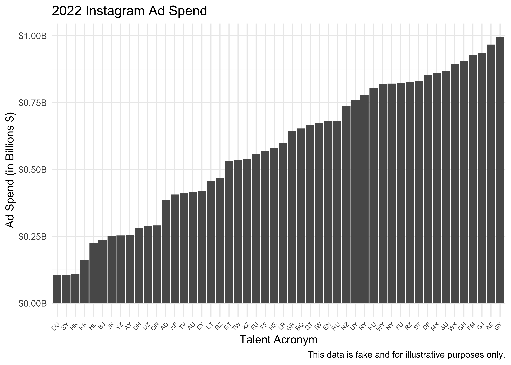
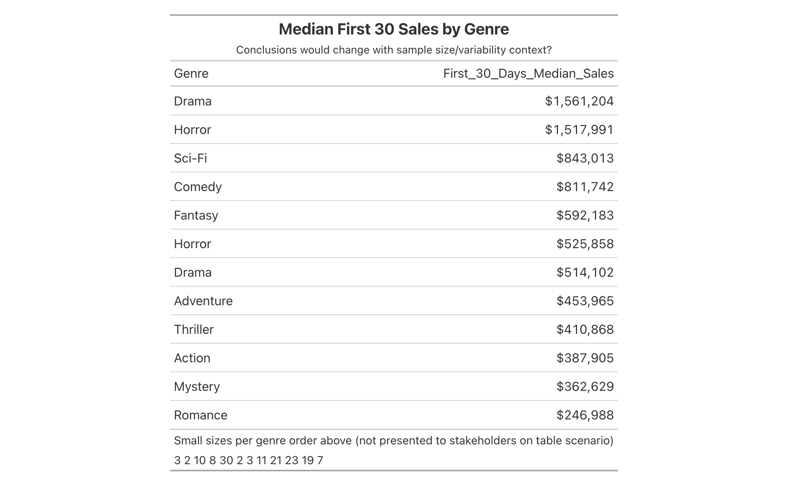
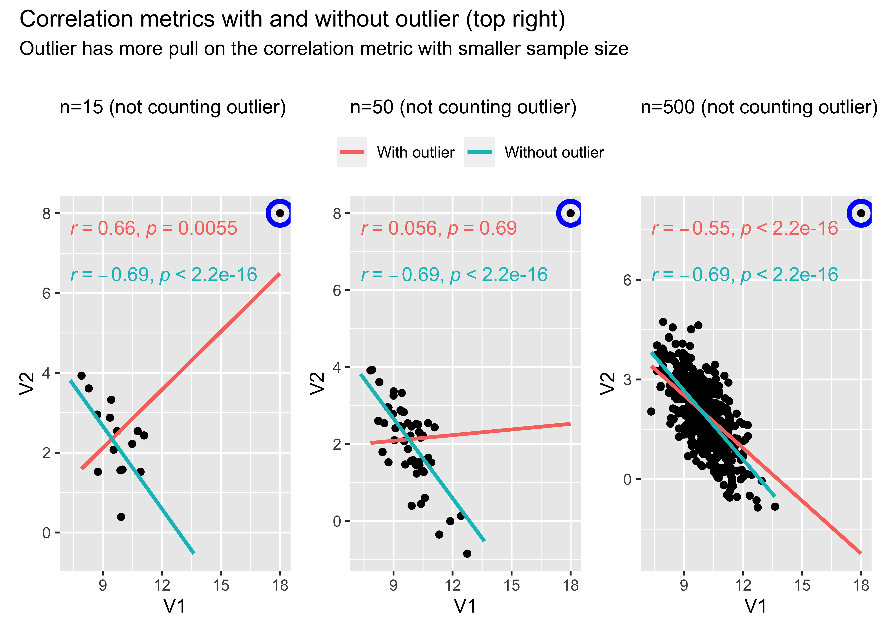
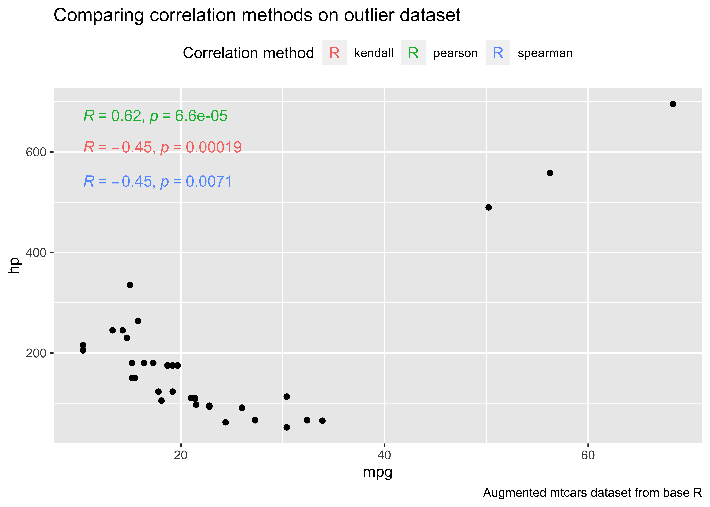
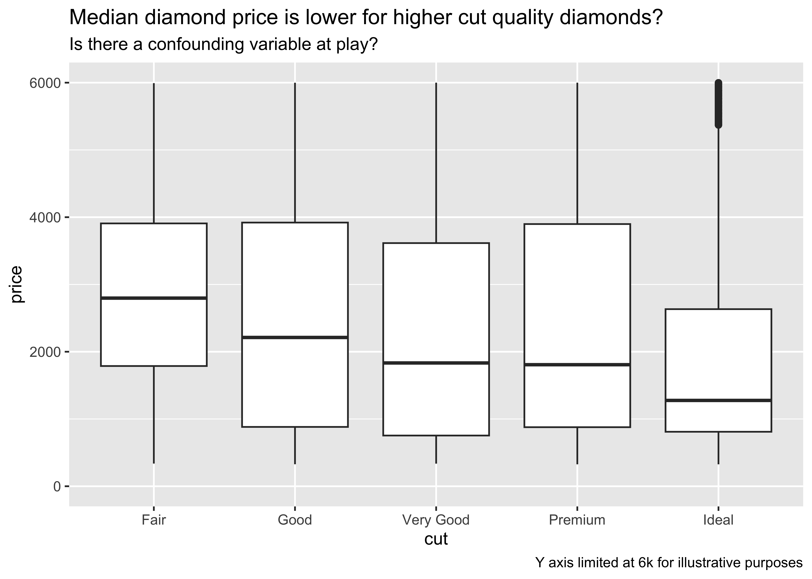
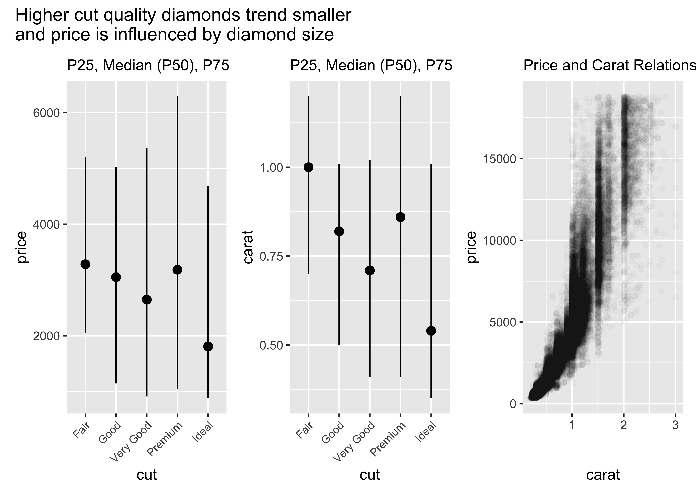
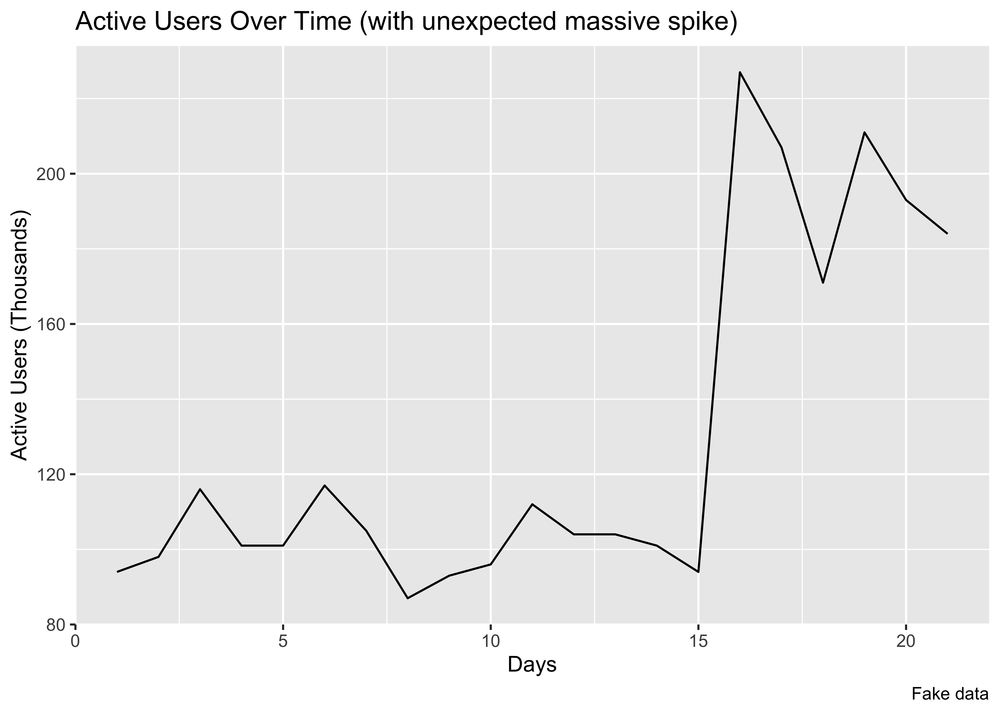
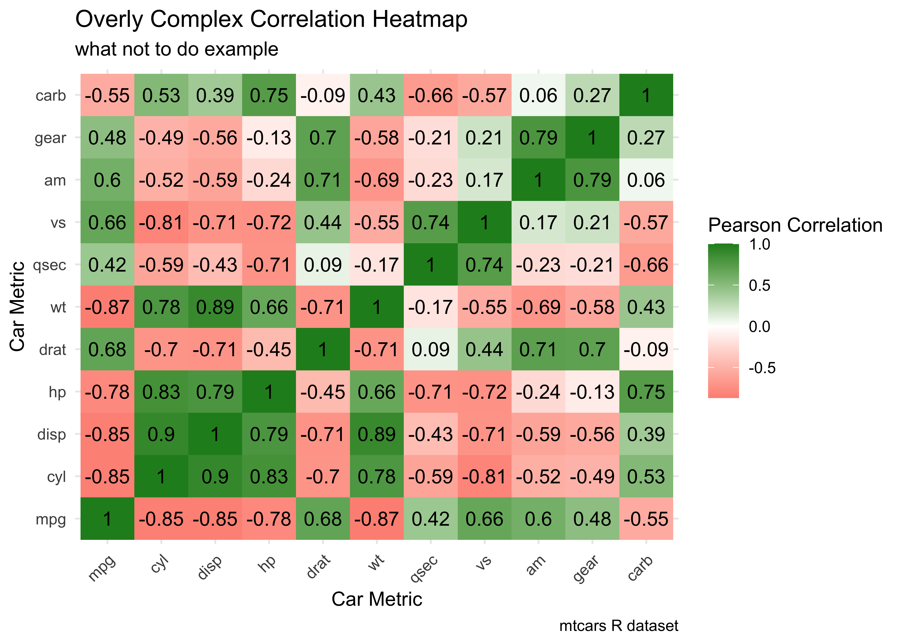

Collection of Data Analysis Mistakes and Learnings
================

The example scenarios below are inspired by real world mistakes I’ve
made and/or issues I’ve observed first hand.

## 1. Not applying business context on top of data used for analysis/visualization

- Learning: sanity check data against your macro business
  context/judgement.
- Are these realistic spend levels?

<!-- -->

## 2. Nudging stakeholders to incorrectly draw conclusion from small sample sizes / variable data

- Learning: include sample size counts by default + measures of
  variability (via metrics and/or visualizations).

## 3. Not handling outliers when deriving correlations (1 of 2)

- Learning: watch out for outliers when deriving correlations
  (especially with small sample sizes and when using Pearson
  correlation)

<!-- -->

## 4. Not handling outliers when deriving correlations (2 of 2)

- Learning: rank based correlation metrics (i.e. Kendall, Spearman) less
  sensitive to outliers

<!-- -->

## 5. Not slicing the data and missing a segmentation story or confounding variable (1 of 2)

<!-- -->

## 5. Not slicing the data and missing a segmentation story or confounding variable (2 of 2)

<!-- -->

## 6. Teyman’s law: the more interesting the data the more likely it’s due to error

- Learning: when stable/normal metrics break away from the norm check
  for analytics tracking issues and/or data pipeline issues.

<!-- -->

## 7. Overly complex data visualization without clear insight

- Learning
  - keep it simple
  - business stakeholders should be able to get the point of the
    visualization in a quick and intuitive way

<!-- -->
